## Noam Aharon's Final Project for Command Line GIS 651

# Intersection of Industrial Facilities, Flood Hazards, and Social Vulnerability in Hillsborough County, Florida 

Industrial and commercial facilities that manage hazardous materials can become a source of toxic pollution and contamination during flooding events. Flood waters can overwhelm a facility's capacity to safely store its materials, resulting in a discharge of harmful chemicals and wastes into surrounding communities. The threat of a toxic release further exacerbates the more apparent issues that occur from large flooding events (such as power outages, critical infrastructure damage, and loss of life). Vulnerable communities in flood-prone areas situated near industrial and commercial facilities face the greatest risks associated with flood-driven toxic releases.

Residents of Hillsborough County, in Western Florida, have been hit hard this past year by a series of hurricanes and tropical storms resulting in widescale flooding. After the storms subsided, it was discovered that much of the flood water was contaminated with a slew of toxic chemicals and materials coming from wastewater treatment plants, oil tankers, and manufacturing facilities. To improve the preparedness and resiliency of communities in regard to flood-driven toxic releases, this project aims to identify facilities of concern (defined as facilities that can discharge hazardous materials during a flood) and determine the level of threat the facilities pose to surrounding communities. The threat that a facility poses will be determined by its proximity to socially vulnerable communities (defined by the CDC's SVI) and high-risk flood zones (defined by FEMA). City planners and legislators can use this information to reinforce certain facilities of concern, and more importantly, place measures in the most at-risk areas to prevent toxic releases from becoming a humanitarian disaster.

I will first introduce the datasets used in this project and describe the methodologies used to clean and manipulate the datasets for analysis. I will display static maps throughout the data/methodology section as well as the results section. Lastly, I will present an interactive web map showing the relationship between facilities of concern and the various hazard zones identified for the analysis. While it is recommended to read all sections and gain context prior to viewing the web map, you may jump to the web map by clicking HERE.

Data Description and Methodology

<a href="https://www.atsdr.cdc.gov/placeandhealth/svi/interactive_map.html"> Social Vulnerability Index by Census Tract </a> - CDC, 2020 Data. 
  
<b>Data Description</b>
  
<em>What is Social Vulnerability?</em>
  
  

"Every community must prepare for and respond to hazardous events, whether a natural disaster like a tornado
or a disease outbreak, or an anthropogenic event such as a harmful chemical spill. The degree to which a
community exhibits certain social conditions, including high poverty, low percentage of vehicle access, or
crowded households, may affect that community’s ability to prevent human suffering and financial loss in the
event of disaster. These factors describe a community’s social vulnerability (CDC)."

<em>What is CDC Social Vulnerability Index?</em>
 
  

"SVI indicates the relative vulnerability of every U.S. Census tract. SVI ranks the tracts on 15 social factors, including unemployment,
minority status, and disability, and further groups them into four related themes. Thus, each tract receives a
ranking for each Census variable and for each of the four themes, as well as an overall ranking (CDC)." The scale goes from 0 to 1 (low to high social vulnerability). The CDC/ATSDR has prepared the SVI based on variables and data collected by the US Census Bureau.

 

The SVI can help determine a community's level of preparedness and resiliency to deal with a human or natural disaster. For the purposes of this analysis, I am interested in identifying the most socially vulnerable communities in Hillsborough County, Florida, to explore their proximity to facilities of concern. According to the CDC's interactive SVI map, census tracts with an overall SVI ranking of .75 and above are considered areas with high social vulnerability. Census tracts with .75 SVI or higher will become one of the two hazard zones or areas that is defined for the analysis. These hazard zones/areas are places where the harmful effects of toxic releases from facilities of concern are exacerbated.

<b>Data Cleaning and Methodology</b>

I downloaded a csv file of SVI data for every census tract in Florida. The SVI data includes all the variables that go in to calculating the overall SVI ranking. Since I'm only interested in the overall SVI, I dropped most of the columns from the csv. I then filtered the dataset to Hillsborough County and joined the dataset to a geodataframe that includes the geometries of the census tracts in Hillsborough County. Census tracts that are located in the water were dropped from the geometry. Initially, the number of rows in my SVI dataset did not match the number of rows in the geodataframe (333 vs 335). I soon realized however, that the geodataframe of census tracts was from 2022, while the SVI data was 2020. I then downloaded census tract geometries from 2020 and both datasets matched. Below is a choropleth map displaying the SVI values for every census tract in Hillsborough County. The dark blue census tracts (SVI of .75 and above) is defined as one of the two hazard layers that will be used to conduct the facility threat analysis.
  
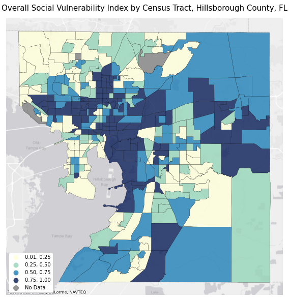
  
  
  
<a href="https://msc.fema.gov/portal/advanceSearch#searchresultsanchor"> National Flood Hazard Layer </a> - FEMA, Last updated November 11, 2022.
  
<b>Data Description</b>

  
The National Flood Hazard Layer (NFHL_12057C) from the FEMA Flood Map Service Center is a shapefile that displays the different flood insurance zones defined by FEMA for the entire country. Flood zones are defined by their varying levels of flood risk. High risk zones are areas where there is at least a 1% chance of annual flooding and a 26% chance of flooding during a 30-year period. Moderate to low risk zones are areas where the risk of flooding is reduced but not completely removed. Flood insurance is not required in these zones. Click <a href="https://www.fema.gov/blog/fema-flood-maps-and-zones-explained"> here </a> for a more detailed explanation of the zones.

<b>Data Cleaning and Methodology</b>

Since shapefiles already contain geometries, I did not have to convert the original dataset to a geodataframe. I did, however, discover that the shapefile of flood zones for Hillsborough County contained over 9,000 polygons making it difficult to display in both matplotlib and folium. To simplify the dataset, I dissolved the shapefile by the 7 flood zones present in the data to create 7 rows of multipolygons. I then dropped the "open water" zone as it is irrelevant to my analysis. To further clean the dataset, I clipped the flood zones to the geometries of my census tracts, ensuring that both those datasets covered the exact same area. The flood zone data was then clean enough to display on the static map below. All flood zones in Hillsborough County that start with the letter "A" and "V" are high-risk flood zones and will be considered the second overall hazard zone/area used for the analysis. The "X" flood zone is considered low-risk and will therefore be dropped later to create a layer that only includes high-risk zones. The flood zone dataset, however, still had too many intricate shapes and geometries to visualize on an interactive map. Therefore, I created a unary union of all high risk flood zones and simplified the geometries to a tolerance of 100 feet. The high risk flood map layer on the interactive map is a product of these geoprocessing steps.

 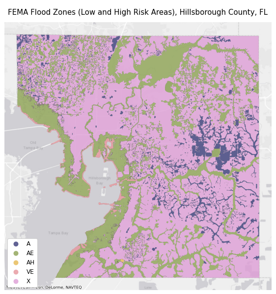
  

<a href="https://floridadep.gov/water/domestic-wastewater/content/wastewater-facility-information"> Florida Wastewater Facilities (Industrial and Domestic) </a> - Florida DEP, Last updated October 31st, 2022. 

<b>Data Description</b>
 
The Florida Department of Environmental Protection has prepared a database of wastewater facilities across the state. The site provides a csv file for different types of facilities. Although domestic wastewater facilities serve non-industrial purposes, many of them manage enough waste to generate a large toxic release during flooding events. Therefore, I decided to include both the industrial and domestic wastewater facilities in my analysis. The datasets include the names, addresses, capacities, and status of activity for each wastewater facility in Florida (around 6,000 total).
 
<b>Data Cleaning and Methodology</b>
 
After filtering the data to Hillsborough County, I merged the two datasets and deleted any duplicate facilities (which were about 15). Since there was no locational data attached to the facilities, I had to geocode the merged dataset using the addresses provided by DEP. Many of the addresses in the data were incomplete and therefore returned poor or no results after running the geocoder. I manually cleaned most of the addresses using google maps as a reference, dropping addresses of facilities that no longer existed or were inactive. I got a 97% and above match for all but 5 of the 294 addresses. Those 5 addresses were located, according to the original data, outside of Hillsborough County, and therefore, dropped. After dropping more duplicates and faulty addresses, I was left with 291 domestic and industrial wastewater facilities attached to their coordinates/geometries in a geodataframe. Wastewater facilities comprise the vast majority of all the facilities being explored in this analysis. However, they are not the only type of facilities that store or manage hazardous materials. I therefore had to bring in more datasets.
 
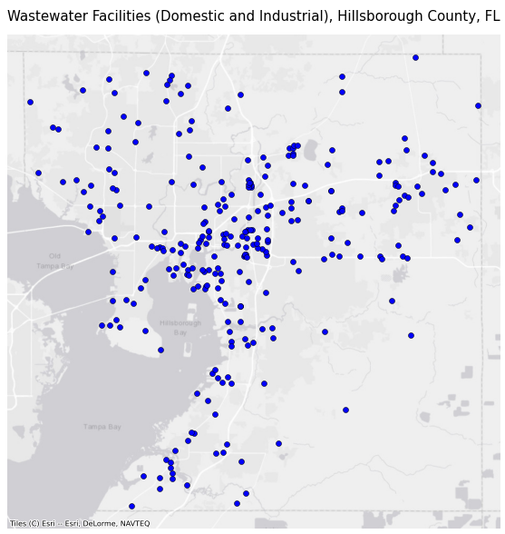
 
  
<a href="https://koordinates.com/layer/110586-florida-hurricane-facilities-of-concern/"> Florida Hurricane Facilities of Concern </a> - Koordinates from Florida DEP, Last updated September 29, 2022. 
  
<b>Data Description</b>
 
The Florida Hurricane Facilities of Concern dataset identifies facilities across the state that store or manage hazardous waste. These facilities are noted for their potential to release hazardous materials during a large flooding event such as a hurricane. The dataset was prepared by Florida DEP but was downloaded from a site called "Koordinates," which claimed to have more recently updated information than the DEP itself. After some research I found that this source is credible and may have had someone from the DEP update it before updating the DEP GIS maps. Facilities of concern include "Treatment, Storage, and Disposal facilities (TSDs) that are permitted to manage hazardous waste; hazardous waste transfer facilities where hazardous waste may be stored or staged for up to 10 days; used oil transfer facilities where used oil may be stored or staged for up to 35 days; and large quantity generators (LQGs) of hazardous waste that generate more than 1000kg of hazardous waste in any one month and may store their hazardous waste for up to 90 days (DEP)." Note: Moving forward I will refer to all facilities in my analysis as "facilities of concern," which not be confused with this specific dataset.
  
<b>Data Cleaning and Methodology</b>

I downloaded a csv for all Facilities of Concern in Florida. The dataset included latitude and longitude coordinates which made it easy to convert to a geodataframe and create a point layer. The data was then filtered to Hillsborough County. Some columns were dropped and others were renamed to make the data more legible. There was a total of 60 facilities identified after cleaning the dataset. This dataset will be merged with the wastewater facilities list to create a growing list of all facilities in Hillsborough County that can be a threat during flooding.          

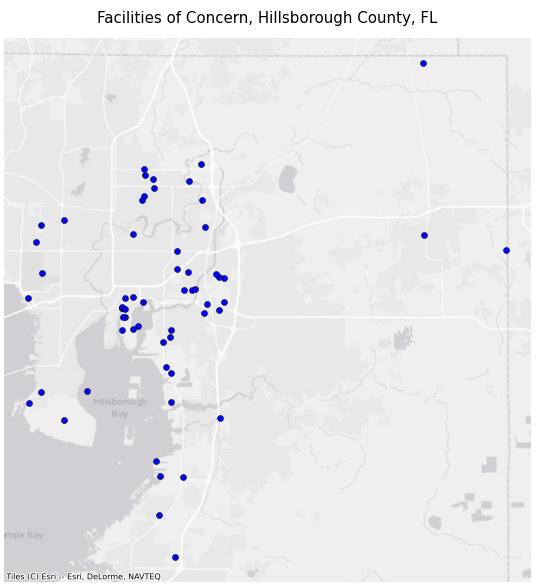
  
<a href="https://www.epa.gov/toxics-release-inventory-tri-program "> Toxic Release Inventory Facilities </a> - EPA, 2021 Data. 
  
<b>Data Description</b>
 
The Toxic Release Inventory (TRI) developed by the EPA is "a resource for learning about toxic chemical releases and pollution prevention activities reported by industrial and federal facilities." While not all facilities have experienced a toxic release in the past, all facilities in this database store hazardous materials and do have the potential to release toxic substances into the environment. The database allows someone to search for facilities at different geographical levels for different years. The inventory also allows for the filtering of facilities based on the materials stored and other variables related to hazardous material capacity. Since I wanted the most up-to-date information, I searched for all TRI facilities in Hillsborough County for 2021.
  
<b>Data Cleaning and Methodology</b>
  
The TRI provided an option to download information about the facilities as a csv file with lat/long coordinates attached. The coordinates made it easy to convert the data to a geodataframe. The geodataframe was then projected to the local coordinate system that I had assigned to all the previous data layers (EPSG:2237). In total, there were 68 TRI facilities. This dataset will be merged with the "Facilities of Concern" dataset as well as the wastewater facilities list to create a master dataset of all facilities of concern.
  
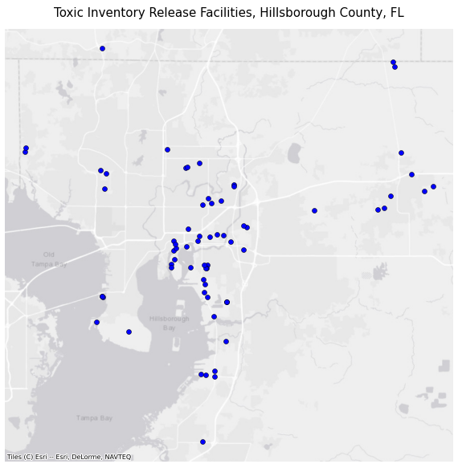
  
  
<em>Merging all facilities</em>
 
                                                             
The process of merging all facility datasets and cleaning them to remove duplicates took most of my time for this project. First, I merged just the Facilities of Concern and TRI facilities datasets together to check for any duplicates. This was done by displaying both datasets on an interactive map and using the name and address fields to find any overlapping information. After identifying and dropping the duplicates between the two datasets, I was left with 108 facilities. I was then ready to merge this new dataset to the wastewater facilities list. It took a while to identify the 30 or so duplicate facilities that existed between the datasets. While I was aware that there would be some overlap, I did not anticipate how difficult it would be to locate. This was mainly because the 3 original datasets had no fields in common. All ID fields used a different alphanumeric system and thus could not be checked by code for duplicates. The formatting of the name and address fields were also different among the datasets, leaving no choice but to manually check for duplicates. While this process was time consuming, I think it is crucial to build a master list of all facilities of concern in order to conduct a thorough analysis that captures the realities of Hillsborough County. After cleaning the final dataset, there was 354 facilities of concern identified. These facilities range from wastewater facilities to oil tankers and manufacturing plants, among others. Since the datasets were messy, I was unfortunately unable to display the facilities by the type of materials they manage or the purpose they serve. 

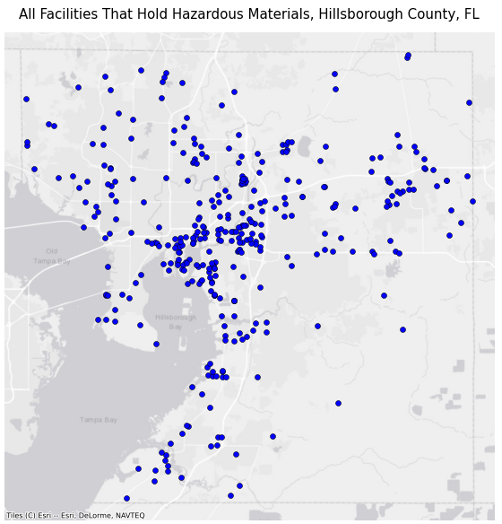
  
<em>Calculating threat score for facilities</em>
 

Each facility will be given a score from 0 to 2 depending on its location in relation to the two hazard zones defined earlier. The first hazard zone is any census tract with a .75 SVI and above. The second hazard zone is any flood zone that starts with the letter "A" or "V." A facility that is located in neither of those zones will be given a score of 0, denoting that the facility poses a low-level threat. A facility that falls in either one of the zones will be given a score of 1, denoting that the facility poses a moderate level threat. Facilities that are located in vulnerable communities are considered a threat since vulnerable communities have fewer resources to deal with a potential toxic release. Facilities that are located in high-risk flood zones are considered a threat since intense flooding increases the likelihood of toxic release and the long-distance travel of toxic materials. A facility that falls both in a high SVI tracts and a high-risk flood zones will receive a score of 2, defining that facility a high-level threat. The intersecting areas of the two hazards zones will also be identified in the following static and interactive maps. This will give viewers a sense of where these hazard zones are and why each facility was given the score that it has.
    

Results (Static Maps)

<em>Identifying which facilities lie in high SVI tracts</em>
 
  
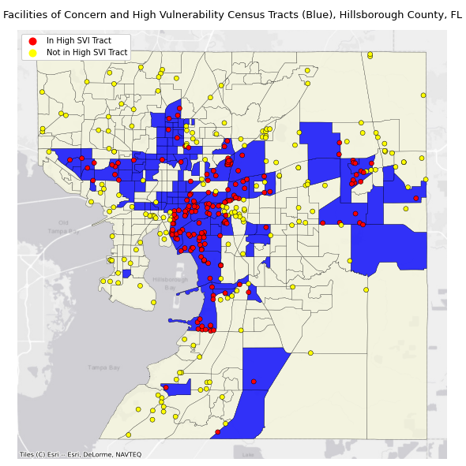
  
 
<em>Identifying which facilities lie in high-risk flood zones</em>
 

 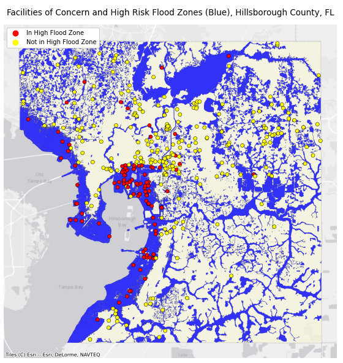
  
<em>Identifying which facilities lie in both hazard zones</em>
 

 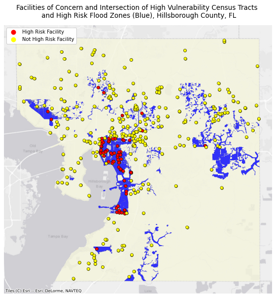
  
 
We see that the high-risk/high-threat facilities are located on the eastern shores of Hillsborough Bay. This area is marked by High SVI census tracts and is susceptible to flooding. The underlying blue areas in the last map represent the areas in which the two hazard zones intersect. Since it could not be displayed easily on a static map, the scores of each facility will be included in the interactive map.  
 
The next 3 maps will show the high threat facilities over a choropleth of different Census Bureau variables. Census tracts that have gray hatch marks represent census data with low reliability. The low reliability comes from a high coefficient of variation. This often occurs when the actual numbers and sample is size is so low that a certain level of data reliability could not be guaranteed. These census variables include the percent of minority population, the percent of the population that is living at the 150% rate (or more), and the percent of population that is uninsured in Hillsborough County. These maps should not imply any concrete relationship between census tract characteristics and high-threat facilities. It is, however, interesting to explore whether or not the spatial pattern of facilities match the spatial patterns of census variables that are used to determine social vulnerability. THe census variables will also be presented as 3 layers on the interactive map. 
  

 
    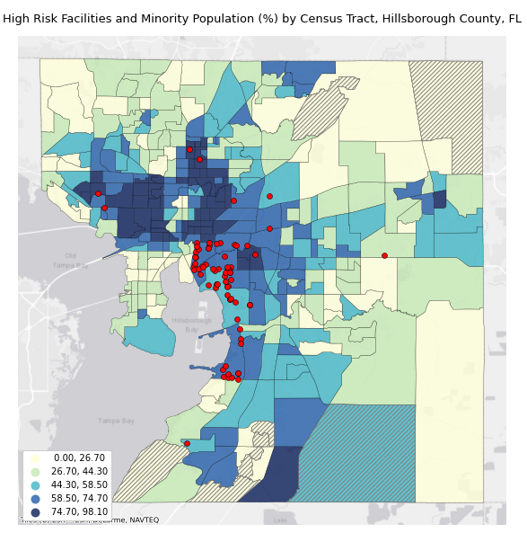
    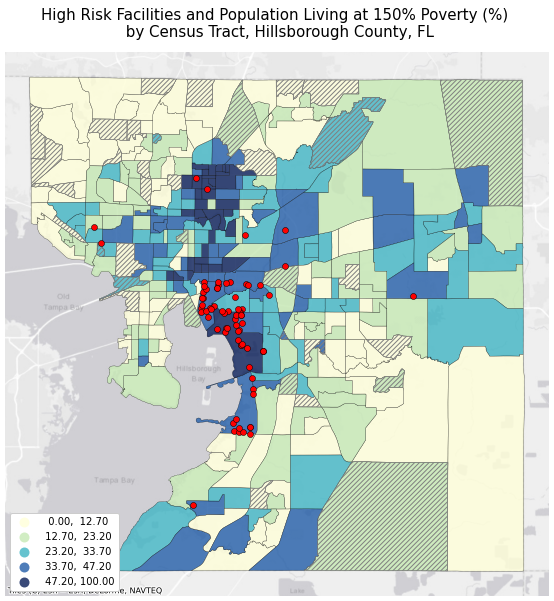 
    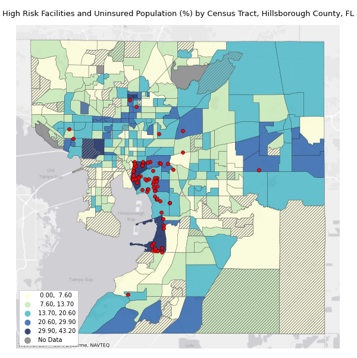 

 
  
  

Site and maps created by <a href="mailto:noamyaakovaharon@gmail.com">Noam Aharon</a> for 34:970:651 Command-Line GIS, Edward J. Bloustein School of Planning and Public Policy, Rutgers University, Fall 2022. 
